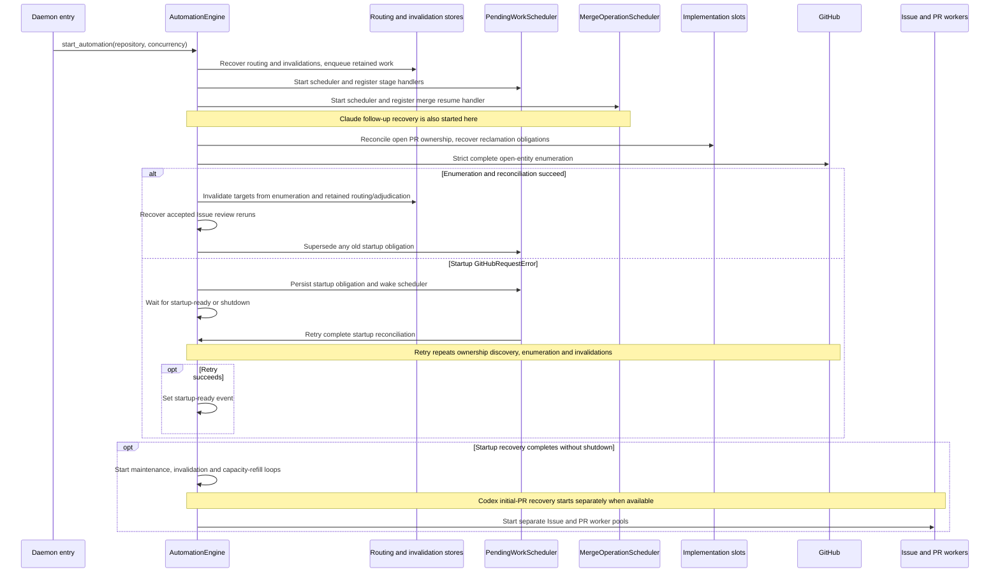
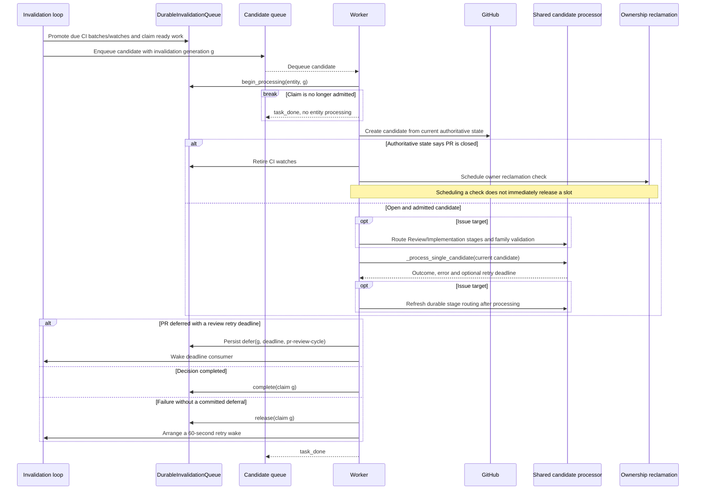
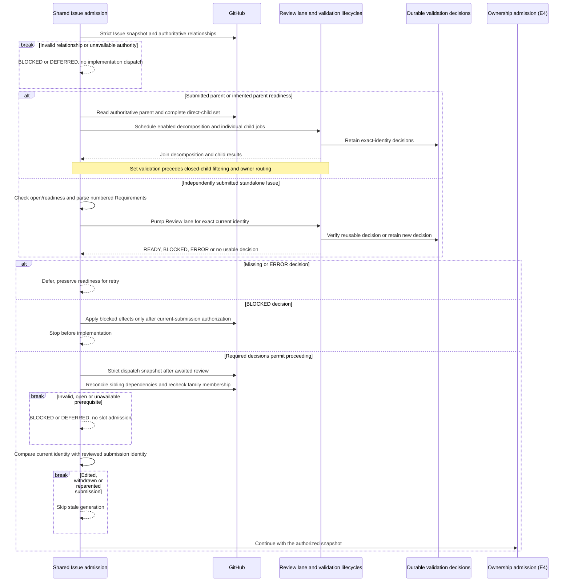
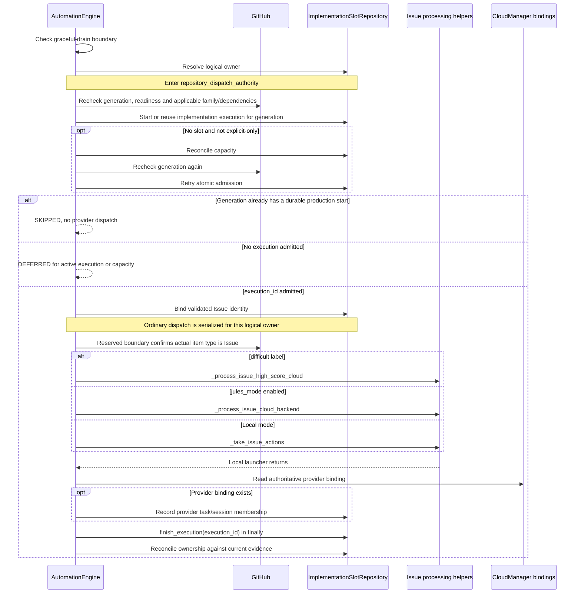

# Engine and Issue admission: as-is sequences

Snapshot: **`95ff379d2bd69e54a53f14c208eedaca5a58e3df`**. [Scope and notation](README.md).

## E1. Startup recovery precedes ordinary workers

Entry: `AutomationEngine.start_automation`. The pending-work and merge-operation schedulers are distinct; a startup GitHub operational failure is recoverable through the already-running pending-work scheduler.

The successful enumeration invalidates entities while it runs; the dirty-target arrow summarizes those calls, not an extra scan. An incomplete enumeration does not set `startup_reconciled=True`. Retained routing/adjudication targets absent from the open enumeration are also reevaluated. Other startup exceptions can propagate instead of becoming this retry path.

Sources: [startup and handler registration][startup], [enumeration and maintenance][enumeration].

## E2. Invalidation is a request to observe, not permission to act

Entry: an already-retained entity invalidation, from startup, webhook intake, or another wake producer. HTTP webhook authentication and payload-to-target mapping are outside this sequence. CI SHA correlation and CI-watch deadlines are promoted by the invalidation loop before worker intake.

Issue admission-cache refusal and observed dependency-wait fast paths can run before the strict candidate fetch; the diagram expands the path that reaches that fetch. A strict-refresh operational deferral has its own durable `defer` path. If recording that deferral fails, the worker stops without claiming successful completion; this is not the ordinary release/retry branch above. Draining can stop before dispatch while leaving durable ownership recoverable.

Sources: [CI promotion and invalidation loop][enumeration], [worker refresh, closed-PR handling and timed deferral][worker], [completion/release][worker-finally].

## E3. Issue specification and family admission

This sequence expands the new-admission path that reaches the specification gates, not retained-owner continuation or manual retry. Relationship reconciliation can mutate GitHub parent metadata before semantic validation; it is not merely a local parser. A submitted parent with direct children is treated as a family rather than assumed to be a standalone implementation target.

The ownership continuation is for an implementable child or standalone Issue, not a parent used as a family container. Parent-to-child routing reenters shared admission; it is not expanded into a parent implementation here.

Semantic validation can be disabled by its configuration switches; this does not remove the manifest, readiness, relationship or final freshness gates illustrated here. An invalid manifest has a separate strict-comment-read/deduplicated diagnostic path and cannot dispatch. A stored terminal decision is not reused merely because it says `READY`: the Review lane reestablishes its identity/evidence applicability. Family ERROR/BLOCKED outcomes are evaluated before implementation eligibility is granted.

Sources: [shared entry and submitted-parent handling][admission], [Review lane reuse][review-lane], [readiness, manifest, semantic verdict and sibling gates][specification], [final identity and membership checks][ownership].

## E4. A local execution ending is not ownership ending

Continuation from E3 for a new ordinary Issue execution. PR candidates share ownership admission but have their own policy gates. Provider internals are intentionally represented by their real entrypoint helper, not by a fictional single remote API.

`--only` bypasses capacity in this path; forced PR recovery has a separate active-execution bypass. That is not blanket permission to bypass Issue semantic generation checks. The normal Issue path can still refuse a generation with a durable start. Explicit `--only --force --retry` follows additional durable retry-authority handling, not expanded here.

A failed provider launch marked `CloudSubmissionNotStartedError` permits unbound-idle cleanup only after the code confirms both no CloudRun and no binding. An unreadable provider store retains ownership instead. A closed-PR observation schedules fresh reclamation checks; the capacity-refill loop consumes those checks and can then admit other Issues. Neither `finish_execution` nor a terminal PR alone is depicted as unconditional slot release.

Sources: [final freshness, admission and cleanup][ownership], [reserved dispatch and binding mirror][dispatch], [refill and reclamation consumer][refill].

[startup]: https://github.com/kitamura-tetsuo/auto-coder/blob/95ff379d2bd69e54a53f14c208eedaca5a58e3df/src/auto_coder/automation_engine.py#L2467-L2685
[enumeration]: https://github.com/kitamura-tetsuo/auto-coder/blob/95ff379d2bd69e54a53f14c208eedaca5a58e3df/src/auto_coder/automation_engine.py#L2680-L2900
[worker]: https://github.com/kitamura-tetsuo/auto-coder/blob/95ff379d2bd69e54a53f14c208eedaca5a58e3df/src/auto_coder/automation_engine.py#L3580-L3810
[worker-finally]: https://github.com/kitamura-tetsuo/auto-coder/blob/95ff379d2bd69e54a53f14c208eedaca5a58e3df/src/auto_coder/automation_engine.py#L3810-L3832
[admission]: https://github.com/kitamura-tetsuo/auto-coder/blob/95ff379d2bd69e54a53f14c208eedaca5a58e3df/src/auto_coder/automation_engine.py#L5132-L5350
[review-lane]: https://github.com/kitamura-tetsuo/auto-coder/blob/95ff379d2bd69e54a53f14c208eedaca5a58e3df/src/auto_coder/automation_engine.py#L3363-L3420
[specification]: https://github.com/kitamura-tetsuo/auto-coder/blob/95ff379d2bd69e54a53f14c208eedaca5a58e3df/src/auto_coder/automation_engine.py#L5600-L5840
[ownership]: https://github.com/kitamura-tetsuo/auto-coder/blob/95ff379d2bd69e54a53f14c208eedaca5a58e3df/src/auto_coder/automation_engine.py#L5840-L6110
[dispatch]: https://github.com/kitamura-tetsuo/auto-coder/blob/95ff379d2bd69e54a53f14c208eedaca5a58e3df/src/auto_coder/automation_engine.py#L6110-L6350
[refill]: https://github.com/kitamura-tetsuo/auto-coder/blob/95ff379d2bd69e54a53f14c208eedaca5a58e3df/src/auto_coder/automation_engine.py#L3420-L3580
