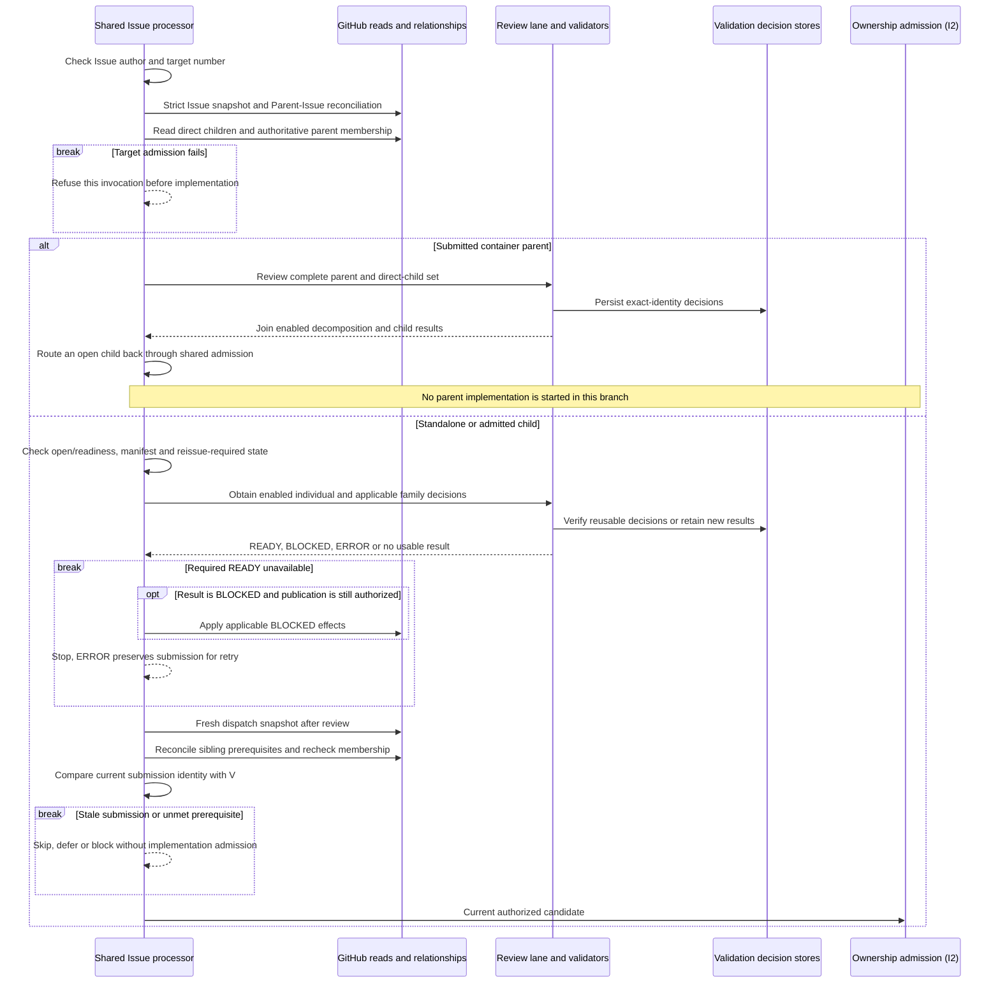
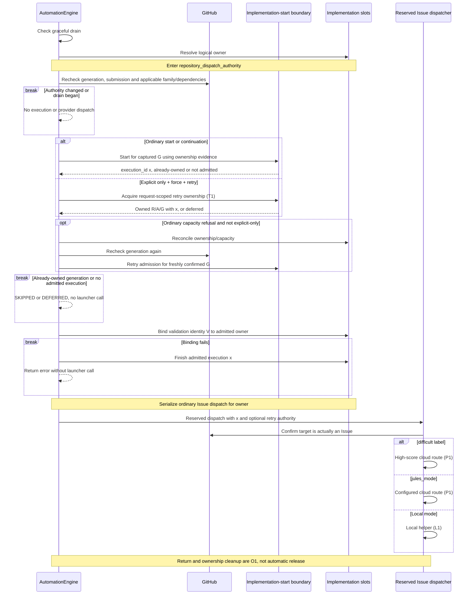

# Issue implementation lifecycle: as-is sequences

Snapshot: **`d704b54e59ea559cce17d5cfe1a0841ac3ef465d`**. This is a source trace, not a desired architecture, an execution recording, or a new behavioral contract. [Shared notation](README.md). The earlier E1-E4 overview remains pinned to its own, older snapshot; this series expands the Issue side at the commit named here.

## Reading order and boundaries

| Document | Sequences |
| --- | --- |
| This document | I1 submission and specification gates; I2 ownership admission and reserved dispatch |
| [Local execution](issue-local-execution.md) | L1 branch, editing and commit/push; L2 PR publication and ownership association |
| [Provider dispatch](issue-provider-dispatch.md) | P1 configured routing; P2 Codex submission; P3 singleton Jules/Claude Routine; P4 speculative Jules candidates |
| [Retry and recovery](issue-retry-and-recovery.md) | T1 explicit retry authority; T2 creation replay; T3 stale Jules replacement; T4 initial Codex PR recovery |
| [Ownership and resumption](issue-ownership-and-resumption.md) | O1 launcher return and cleanup; O2 PR-backed retirement; O3 deferred Issue evaluation |

The covered entrypoints are the shared candidate path used by workers and capacity refill, explicit `process_single`, and the named recovery paths. These are responsibility views of existing calls, not separate services. Backend CLI/SDK internals, model compliance with prompts, speculative winner adjudication/loser cleanup, recurrent tasks, and PR review/merge internals are not expanded. The last of these has its own [PR sequence series](pr-ci-and-repair.md).

## Identities that must not be conflated when reading the source

| Symbol | Source meaning |
| --- | --- |
| `I` | Issue number within the repository; a GitHub Issue API object can instead represent a PR, so type checks matter |
| `g` | Invalidation generation: which dirty observation a worker acknowledges |
| `V` | Exact specification-validation identity; durable READY is checked for applicability, not interpreted as a general permit |
| `G` | Implementation generation: digest of target contract identity and sorted family contract keys |
| `owner`, `x` | Logical `ImplementationOwner("issue", I)` and one local execution ID |
| `R`, `A` | Durable explicit retry request ID and its distinct implementation attempt ID |
| `a` | Numeric attempt read/projected through the attempt machinery; used in local branch names and Codex CloudRun keys, not identical to `A` |
| `task`, `candidate` | Provider identity and, for speculative Jules, a candidate within a separately persisted competition generation |
| `inc`, `rev` | Reservation incarnation and activity revision used to reject stale retirement observations |

`ContractIdentity` includes repository, Issue number, database ID, title, body and role. `implementation_generation` adds the family contract keys; review verdicts, queue priority and provider progress are not arguments to that function. `G` is neither a Git SHA nor proof of successful implementation. The owned-start record says production responsibility was acquired, possibly before an external task was sent. [Identity functions][identity] [Ownership decisions][ownership]

## I1. Submitted Issue to an applicable implementation candidate

Entry: `_process_single_candidate_unified_impl` for an Issue. This expands the path that reaches specification admission; retained-owner deferral and the container-parent branch can return earlier. Webhook authentication/intake is outside the diagram.

The initial refusal covers ambiguous type, relationship failure and a closed or unsubmitted target. The required-READY refusal covers missing, ERROR and BLOCKED results. The BLOCKED-effect arrow is conditional on a BLOCKED result; an ERROR is not permission to publish a material defect or withdraw readiness. Disabling a semantic validator removes that enabled review requirement, not the manifest, relationship, readiness or final freshness checks. A child is not detached from its submitted parent simply because it has its own readiness label. A container with no open children follows guarded container-completion handling, not the child-dispatch arrow.

Existing owner activity is considered before new implementation: active executions and retained PR/provider membership can defer a different generation. Ordinary retained-owner reevaluation may review a changed standalone specification but does not silently replace that work. An unbound idle owner has a narrower cleanup path; it is not evidence that all old generations may be rerun. [Shared entry and container routing][entry] [Retained-owner and readiness paths][retained] [Specification and final dispatch gates][gates]

## I2. Production ownership precedes provider selection

Continuation: an implementable standalone Issue or child has passed I1. Explicit retry uses T1 at the admission fork; ordinary reprocessing does not acquire that authority merely through `--force`.

`--only` bypasses ordinary capacity here. It does not bypass current-submission checks or the historical owned-start decision. The separate forced-PR active-execution bypass is not an Issue bypass. If validation-identity binding fails after admission, the code finishes that execution and returns an error rather than entering the launcher.

The ownership bridge distinguishes START_NEW, CONTINUE, SUPERSEDE, ALREADY_OWNED, BUSY_OTHER_GENERATION and AMBIGUOUS_BINDING. It records a prior generation's acquired-start fact before rebinding an idle owner. Finishing work or releasing capacity is not deletion of that fact. A crash between production acquisition and routing confirmation is handled using the retained generation binding, not by assuming no start happened. The bridge and slot/routing stores remain separate implementation boundaries; this is not a claim of one transaction across all stores. [Admission and finally][admit] [Reserved dispatcher][reserved] [Ownership bridge][ownership]

[identity]: https://github.com/kitamura-tetsuo/auto-coder/blob/d704b54e59ea559cce17d5cfe1a0841ac3ef465d/src/auto_coder/issue_stage_routing.py#L39-L182
[ownership]: https://github.com/kitamura-tetsuo/auto-coder/blob/d704b54e59ea559cce17d5cfe1a0841ac3ef465d/src/auto_coder/implementation_ownership.py
[entry]: https://github.com/kitamura-tetsuo/auto-coder/blob/d704b54e59ea559cce17d5cfe1a0841ac3ef465d/src/auto_coder/automation_engine.py#L5136-L5485
[retained]: https://github.com/kitamura-tetsuo/auto-coder/blob/d704b54e59ea559cce17d5cfe1a0841ac3ef465d/src/auto_coder/automation_engine.py#L5485-L5650
[gates]: https://github.com/kitamura-tetsuo/auto-coder/blob/d704b54e59ea559cce17d5cfe1a0841ac3ef465d/src/auto_coder/automation_engine.py#L5650-L5905
[admit]: https://github.com/kitamura-tetsuo/auto-coder/blob/d704b54e59ea559cce17d5cfe1a0841ac3ef465d/src/auto_coder/automation_engine.py#L5904-L6190
[reserved]: https://github.com/kitamura-tetsuo/auto-coder/blob/d704b54e59ea559cce17d5cfe1a0841ac3ef465d/src/auto_coder/automation_engine.py#L6190-L6415
