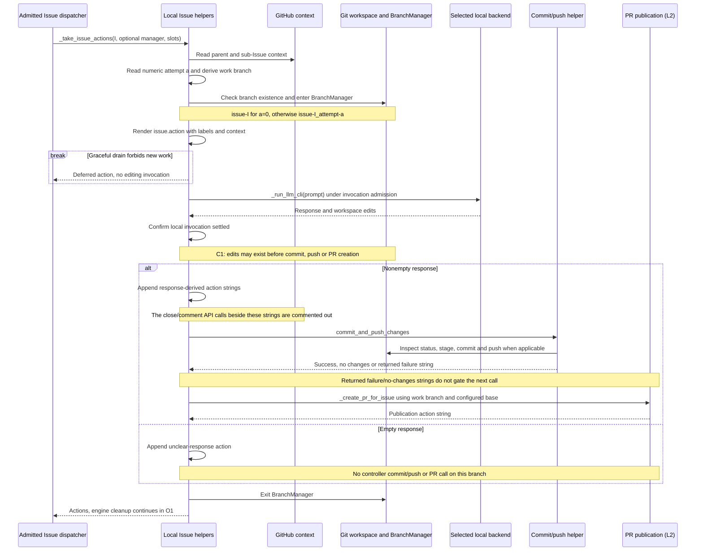
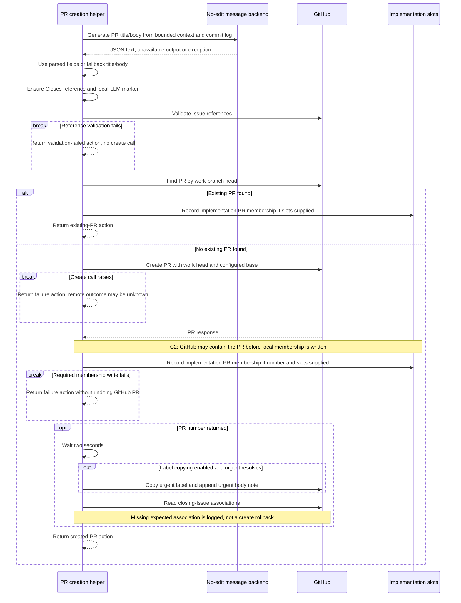

# Local Issue execution: as-is sequences

Snapshot: **`d704b54e59ea559cce17d5cfe1a0841ac3ef465d`**. [Issue lifecycle and identities](issue-implementation.md).

## L1. Working branch, editing invocation and post-processing

Entry: `_take_issue_actions` followed by `_apply_issue_actions_directly`, after engine admission. The diagram expands a regular Issue without `head_branch`, not the helper's PR-shaped input variant. Explicit retry wraps this helper with the T2 creation journal before these effects.

The local `issue.action` call supplies the Issue body truncated to 10,000 characters, parent context and sub-Issue summary where present, label-selected prompt inputs, commit history and configured main branch. These are the inputs actually assembled here, not a promise that every Requirement reaches or is followed by the model. Existing work branches are reused; absent branches are created through `BranchManager`. The helper also contains a sub-Issue-container branch that resets/cleans/checks out/pulls before creation, but I1 normally routes submitted containers instead of assuming that helper branch is the ordinary production path. [Local wrapper][local] [Branch and prompt assembly][response]

There is **no separate controller test-success gate in this illustrated helper between the editing response and commit/PR creation**. The backend may run tests and Git hooks may run checks; those are not evidence that this call site inspected a passing test result. PR CI and merge gates occur later in the PR series. Similarly, nonempty output containing `closed`, `duplicate` or `invalid` produces a “Closed issue” action string, but the adjacent `close_issue` call is commented out; the other branch's “Added analysis comment” also has no corresponding API call. [Response handling][response]

`commit_and_push_changes` returns immediately on empty porcelain output. Staging and push failures can return strings; an unrecovered commit failure instead calls `save_commit_failure_history`, which attempts to write a diagnostic and raises `SystemExit(1)`. That termination is not the returned-failure path that proceeds to L2. Git recovery helpers may invoke additional LLM assistance; the sequence is not a claim of exactly one model call for the entire lifecycle. The local helper rethrows `AutoCoderRetryableBackendError` but logs other ordinary exceptions and returns accumulated actions. [Commit/push and exit][commit]

## L2. PR description, create-or-find and association

Entry: `_create_pr_for_issue` after the L1 call, including after a returned commit/push failure or no-changes result. No PR creation success is assumed at entry.

The message backend is a separate no-edit call. Failure to obtain usable title/body falls back locally rather than proving implementation failed. Label copying in this path is limited to `urgent`; it does not copy every resolved semantic label. The existing-PR early return records membership but does not run the new-PR label/link-verification tail. [PR helper][publication]

A transport exception or failed membership write returns a failure action but does not undo an already-created PR. The find-then-create lookup is not presented as a durable PR-creation claim or an exactly-once guarantee. C2 records the ordering only: later discovery can associate PRs, but this diagram does not invent immediate recovery for an unknown create result. A logged closing-association mismatch can coexist with a returned “Successfully created PR” message. [Publication and exceptions][publication]

[local]: https://github.com/kitamura-tetsuo/auto-coder/blob/d704b54e59ea559cce17d5cfe1a0841ac3ef465d/src/auto_coder/issue_processor.py#L105-L210
[response]: https://github.com/kitamura-tetsuo/auto-coder/blob/d704b54e59ea559cce17d5cfe1a0841ac3ef465d/src/auto_coder/issue_processor.py#L1607-L1870
[commit]: https://github.com/kitamura-tetsuo/auto-coder/blob/d704b54e59ea559cce17d5cfe1a0841ac3ef465d/src/auto_coder/git_commit.py
[publication]: https://github.com/kitamura-tetsuo/auto-coder/blob/d704b54e59ea559cce17d5cfe1a0841ac3ef465d/src/auto_coder/issue_processor.py#L1413-L1606
