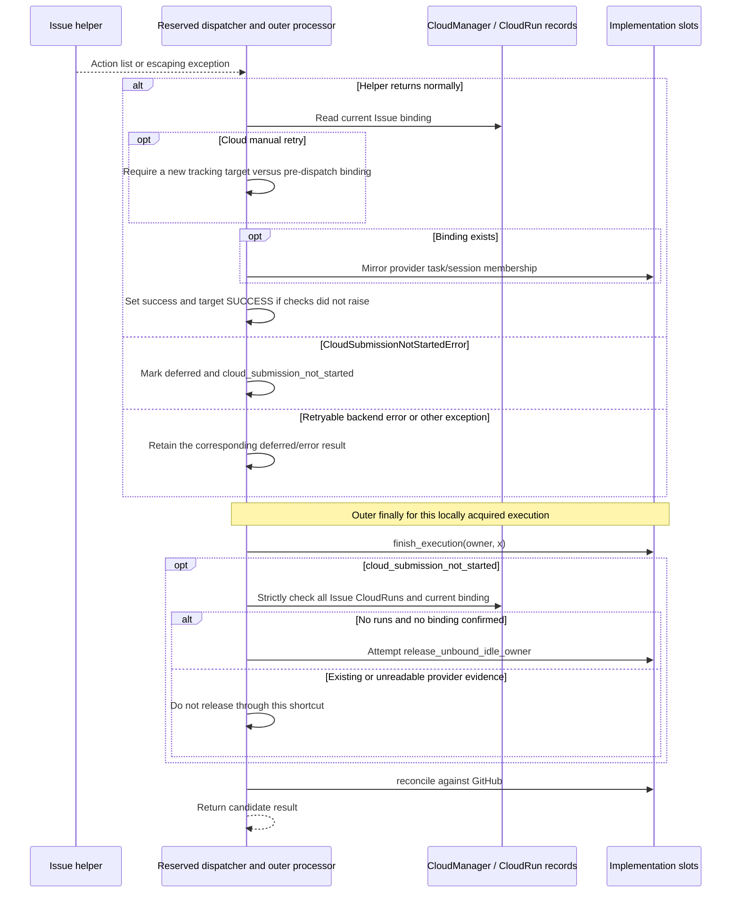
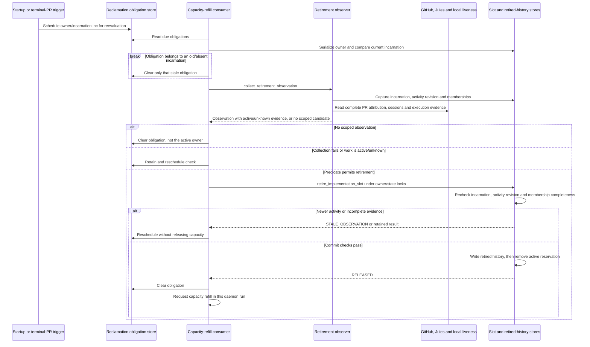
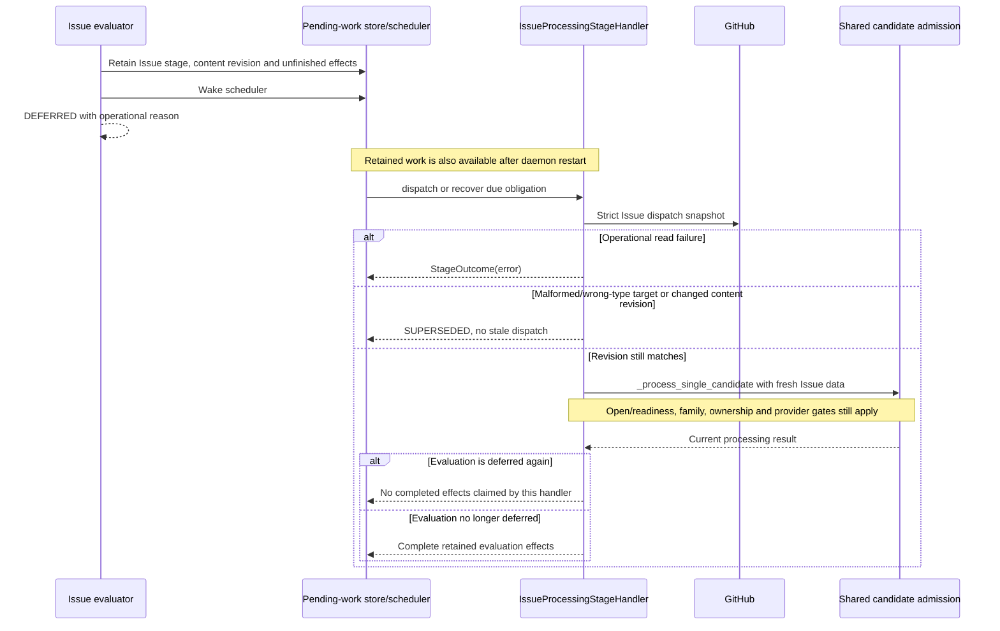

# Issue ownership, retirement and resumption: as-is sequences

Snapshot: **`d704b54e59ea559cce17d5cfe1a0841ac3ef465d`**. [Issue lifecycle and identities](issue-implementation.md). A completed controller call, a provider's completion, a terminal PR, a released reservation and a historical implementation start are separate facts.

## O1. Launcher return does not mean Issue completion

Entry: the reserved Issue dispatcher returning from L1/P1-P4, with a locally acquired execution rather than an inherited execution.

The normal Issue branch sets success after the helper returns and binding handling succeeds; it does not parse every action string as a failure or verify that remote work completed. Thus a returned “Deferred” or “Error” action from a helper can differ from an escaping exception at this boundary. This is a source-reading finding, not an endorsement of those result semantics. Manual cloud retry's changed-binding check and membership persistence can still raise after remote acceptance. Fatal termination, such as `SystemExit` in L1, is not this ordinary result-mapping path. [Reserved result handling][reserved]

The unbound cleanup shortcut is conditional on no CloudRun and no binding, not merely an empty `provider_sessions` list. `finish_execution` and `reconcile` are separate operations; there is no universal finally-block release of the logical owner. An inherited execution is not finished by this outer finally branch. The code also retains an exact historical label-skip-string cleanup branch; `LabelManager` itself is side-effect-free, so that branch is not drawn as an ordinary label-lock protocol. [Outer finally][finally] [Label scope][labels]

## O2. Terminal PR-backed reclamation checks the whole observed owner

Entry: a due reclamation obligation, seeded by startup or a terminal-PR/owner trigger and serviced from the capacity-refill loop. This specialized retirement path covers ordinary Issue-owned, PR-backed local/Jules reservations. It is not a generic Codex/Claude, speculative, recurrent or never-published-owner release algorithm.

PR candidates include retained implementation membership, native closing/Development associations, every attributed Jules PR output and restricted open-PR discovery. The observer distinguishes an unavailable listing from a confirmed empty set. Jules terminal state alone is not the predicate: publication and later activity evidence also matter. Any active PR/session/execution or continuing responsibility retains work; unknown evidence retains it rather than becoming success. [Observer][observer] [Predicate][predicate]

The commit checks `inc` and `rev` against the live record and covers stored memberships. History is written before active removal under locks; those are separate writes, not a demonstrated transaction across files and SQLite. The function can also record the generation tombstone when a routing argument is supplied, but the shown scheduler calls it without that optional argument. These diagrams therefore do not invent an extra routing write at this production call site. [Retirement commit][retire] [Due consumer][consumer]

Startup makes active Issue owners due, including ones missing from the open-PR enumeration because their PR closed while the daemon was offline. That only schedules observation. A `None` observation clears a reclamation obligation without proving the owner was released. A successful release requests refill; refill still performs fresh Issue admission and cannot bypass I1/I2. [Startup seeding and triggers][consumer]

## O3. GitHub operational deferral resumes an evaluation, not a send

Entry: an Issue hierarchy/readiness evaluation catches `GitHubRequestError` at a call site using `_defer_issue_evaluation`. Other exceptions and all provider outcomes are not implicitly this same mechanism.

An effect marked complete here means the retained evaluation was handled, not that an Issue was implemented or merged. A changed revision supersedes this obligation; this handler does not itself manufacture a new-generation dispatch. Invalidation/startup discovery has its own entrypoint for changed entities. BLOCKED-review publication uses a different stage handler that tracks its diagnostic and readiness-withdrawal effects separately; it is not a provider task resend. [Deferral][deferral] [Resume handler][resume]

[reserved]: https://github.com/kitamura-tetsuo/auto-coder/blob/d704b54e59ea559cce17d5cfe1a0841ac3ef465d/src/auto_coder/automation_engine.py#L6290-L6415
[finally]: https://github.com/kitamura-tetsuo/auto-coder/blob/d704b54e59ea559cce17d5cfe1a0841ac3ef465d/src/auto_coder/automation_engine.py#L6150-L6190
[labels]: https://github.com/kitamura-tetsuo/auto-coder/blob/d704b54e59ea559cce17d5cfe1a0841ac3ef465d/src/auto_coder/label_manager.py#L340-L393
[observer]: https://github.com/kitamura-tetsuo/auto-coder/blob/d704b54e59ea559cce17d5cfe1a0841ac3ef465d/src/auto_coder/implementation_retirement_observer.py
[predicate]: https://github.com/kitamura-tetsuo/auto-coder/blob/d704b54e59ea559cce17d5cfe1a0841ac3ef465d/src/auto_coder/implementation_retirement.py#L144-L233
[retire]: https://github.com/kitamura-tetsuo/auto-coder/blob/d704b54e59ea559cce17d5cfe1a0841ac3ef465d/src/auto_coder/implementation_retirement.py
[consumer]: https://github.com/kitamura-tetsuo/auto-coder/blob/d704b54e59ea559cce17d5cfe1a0841ac3ef465d/src/auto_coder/implementation_reclamation_scheduler.py
[deferral]: https://github.com/kitamura-tetsuo/auto-coder/blob/d704b54e59ea559cce17d5cfe1a0841ac3ef465d/src/auto_coder/automation_engine.py#L6408-L6465
[resume]: https://github.com/kitamura-tetsuo/auto-coder/blob/d704b54e59ea559cce17d5cfe1a0841ac3ef465d/src/auto_coder/automation_engine.py#L496-L565
