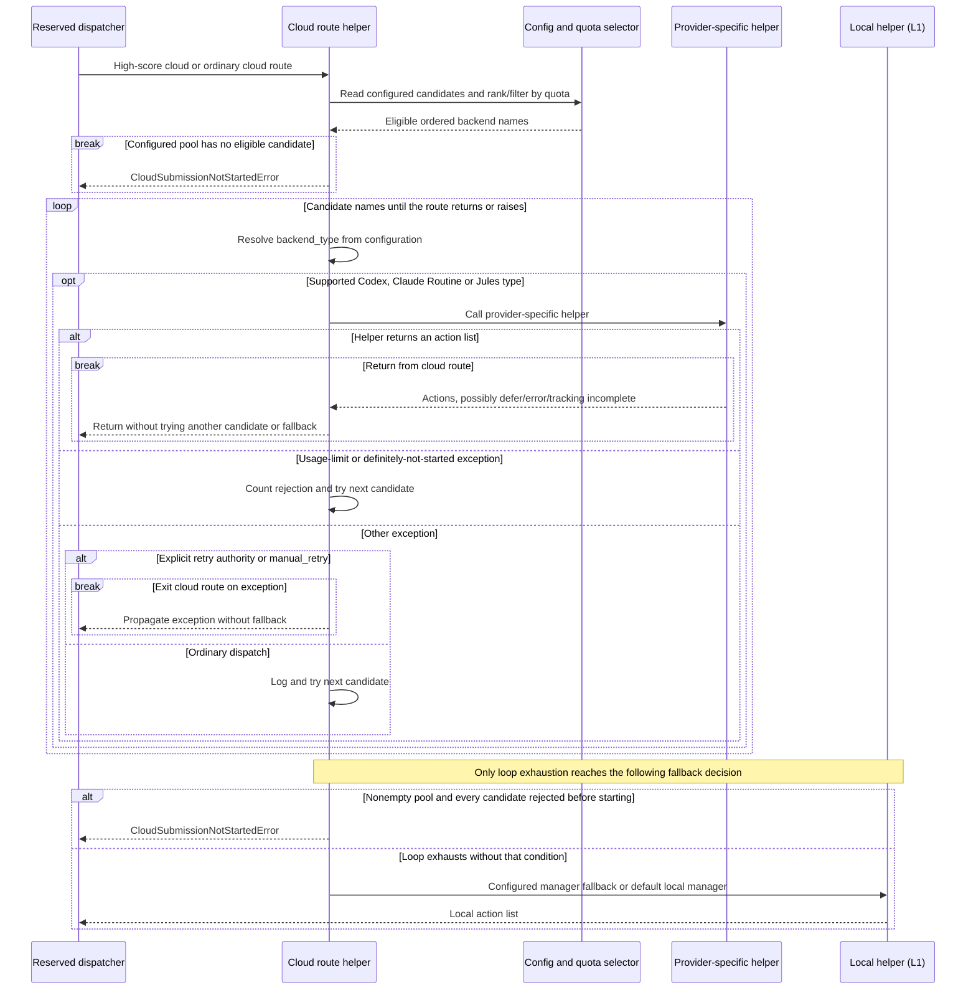
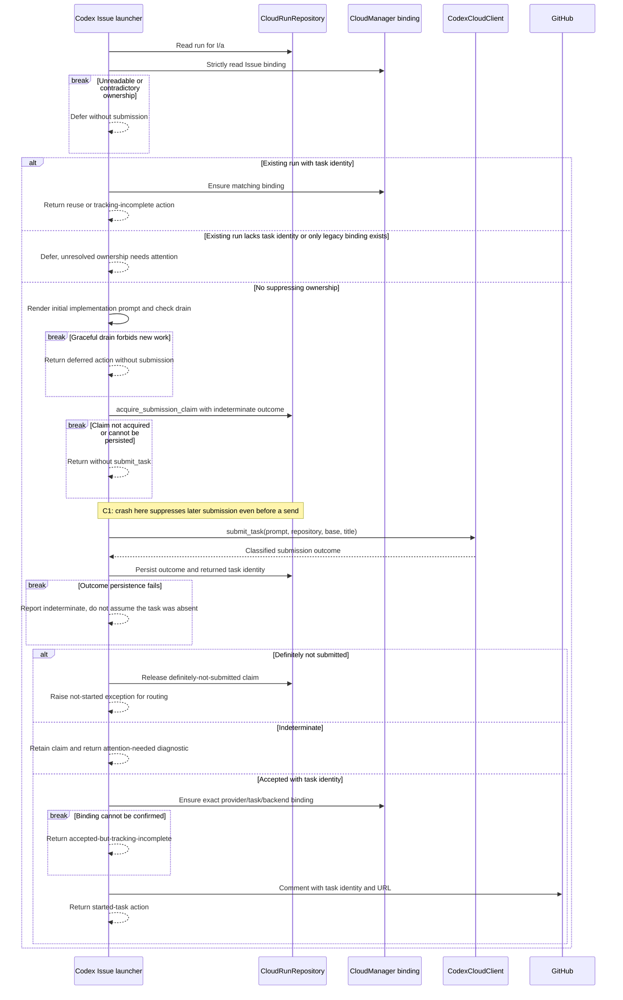
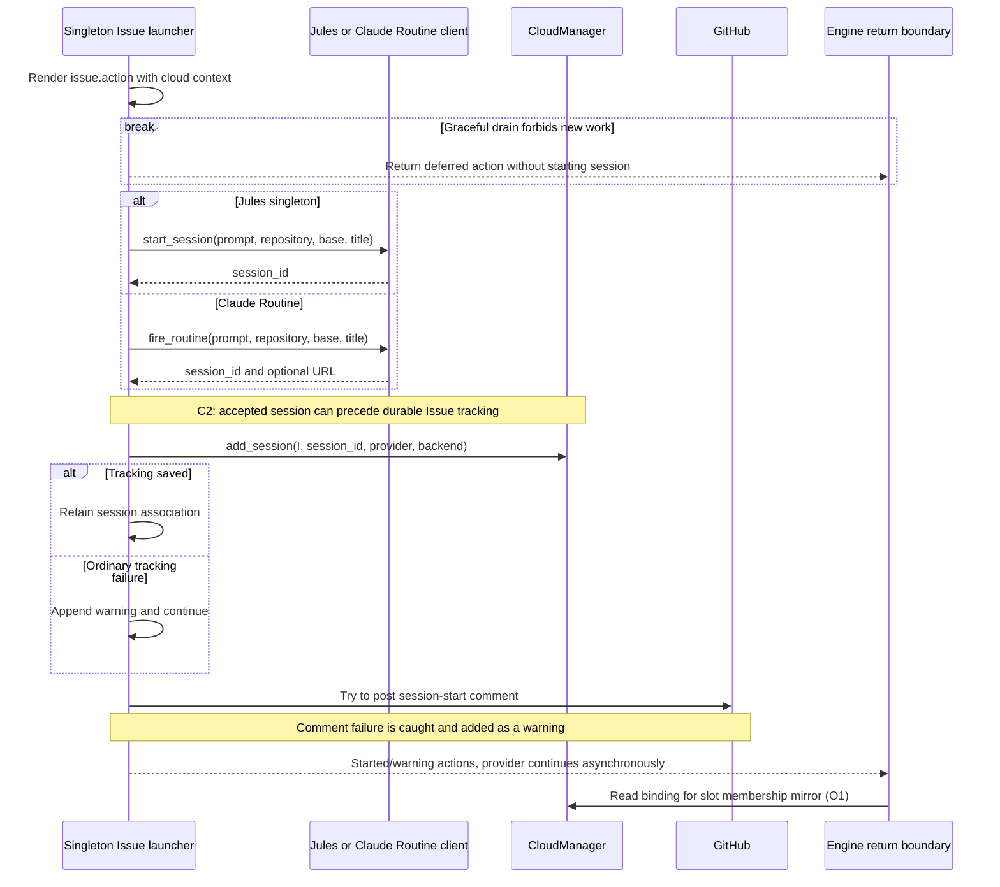
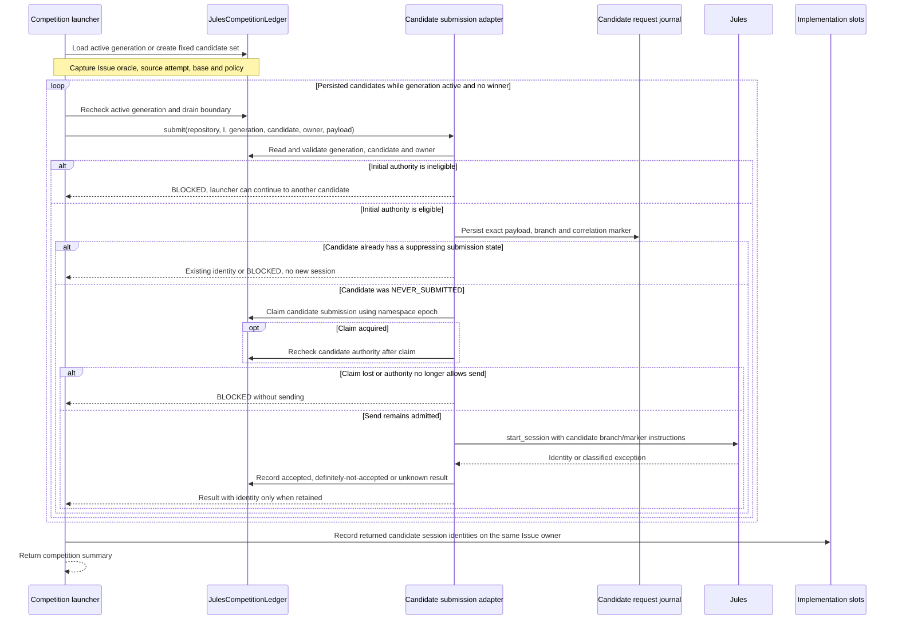

# Issue provider dispatch: as-is sequences

Snapshot: **`d704b54e59ea559cce17d5cfe1a0841ac3ef465d`**. [Issue lifecycle and identities](issue-implementation.md). These sequences begin after I2 ownership admission. Remote model execution and PR publication are not synchronous consequences of a launcher returning.

## P1. Cloud selection is not provider acceptance

The `difficult` branch selects the high-score cloud helper before the ordinary `jules_mode` branch. The latter uses configured cloud providers; its name does not force Jules.

Ordinary cloud configuration prefers priority groups, then ordered backends, then a single configured backend, otherwise `jules`. High-score cloud uses its order or single backend. Unsupported backend types can fall through the loop. A provider helper returning a diagnostic list is still a return, not an exception that activates failover. Conversely, the ordinary generic-exception branch does not itself prove the preceding remote request was never accepted. These are existing routing distinctions, not recommended recovery policies. [Route helpers][routes]

## P2. Codex Cloud persists a suppressing claim before submission

Entry: `_process_issue_codex_cloud_mode` for ordinary dispatch. Its authoritative run key is repository + Issue + numeric attempt `a`. T2 adds another journal when explicit retry authority is supplied.

A usage-limit exception has a separate path that marks the claim definitely-not-submitted, releases it and rethrows. An unexpected exception is not silently converted into an accepted receipt by this function. The no-task-ID claim remains suppressing on reentry. An accepted CloudRun with a missing CSV binding can repair tracking without calling `submit_task` again; a contradictory binding is refused. [Codex launcher][codex]

The Issue comment is after run and binding persistence and is not the deduplication authority. It is not caught locally at that final call, so its failure can reach the route helper even though the task is already recorded. Recovery of a known accepted task's initial PR is T4; that monitor is not a task-ID discovery mechanism for an indeterminate submission. [Accepted tail][codex-tail]

## P3. Singleton Jules and Claude Routine are send-then-bind paths

Entry: ordinary dispatch without explicit retry authority. Jules speculative width greater than one branches to P4 instead. The common shape below stops at acceptance/tracking; it does not equate these two clients' internal HTTP semantics.

The ordinary singleton helpers do not use the Codex CloudRun claim or the speculative candidate-submission adapter. This does not erase I2's prior durable implementation start; it means that prior start and a provider-specific send receipt are different evidence. The Jules helper catches ordinary exceptions and returns error actions. Claude Routine rethrows usage-limit errors, but catches other exceptions in ordinary mode; retry mode instead propagates those errors. A returned action list is not proof of remote delivery. [Jules singleton][jules] [Claude Routine][claude]

With an explicit retry authority, both helpers first claim T2's request-scoped creation record and can repair an accepted session's binding without re-sending. Their retry replay paths guard against an older accepted request replacing a newer accepted request's current pointer. Do not infer this guard applies to every other provider path. `LabelManager.keep_label()` at these call sites is a no-op, not a GitHub label mutation. [Retry journal][retry] [Label scope][labels]

## P4. Speculative Jules captures a fixed candidate set

Entry: Jules route, configured width greater than one, and **no explicit retry authority**. The launcher refuses this path if independent PR adversarial validation is disabled or no backend can be constructed. This diagram expands submission only, not winner selection or cleanup.

The loop submits candidates sequentially; remote sessions can run concurrently. It is not depicted as multiple independent Issue-slot acquisitions. Once a candidate is no longer NEVER_SUBMITTED, repeated `submit` calls do not automatically send another session; the separate reconciliation method uses captured correlation evidence. A returned unknown outcome is not a new candidate or a new generation. The prompt asks candidates to publish isolated PRs, but a prompt instruction is not proof that a remote artifact actually obeyed it. [Competition launcher][competition] [Candidate adapter][candidate]

[routes]: https://github.com/kitamura-tetsuo/auto-coder/blob/d704b54e59ea559cce17d5cfe1a0841ac3ef465d/src/auto_coder/issue_processor.py#L865-L1110
[codex]: https://github.com/kitamura-tetsuo/auto-coder/blob/d704b54e59ea559cce17d5cfe1a0841ac3ef465d/src/auto_coder/issue_processor.py#L631-L810
[codex-tail]: https://github.com/kitamura-tetsuo/auto-coder/blob/d704b54e59ea559cce17d5cfe1a0841ac3ef465d/src/auto_coder/issue_processor.py#L810-L863
[jules]: https://github.com/kitamura-tetsuo/auto-coder/blob/d704b54e59ea559cce17d5cfe1a0841ac3ef465d/src/auto_coder/issue_processor.py#L213-L385
[claude]: https://github.com/kitamura-tetsuo/auto-coder/blob/d704b54e59ea559cce17d5cfe1a0841ac3ef465d/src/auto_coder/issue_processor.py#L445-L630
[competition]: https://github.com/kitamura-tetsuo/auto-coder/blob/d704b54e59ea559cce17d5cfe1a0841ac3ef465d/src/auto_coder/issue_processor.py#L386-L444
[candidate]: https://github.com/kitamura-tetsuo/auto-coder/blob/d704b54e59ea559cce17d5cfe1a0841ac3ef465d/src/auto_coder/jules_candidate_submission.py#L99-L249
[retry]: https://github.com/kitamura-tetsuo/auto-coder/blob/d704b54e59ea559cce17d5cfe1a0841ac3ef465d/src/auto_coder/retry_dispatch.py
[labels]: https://github.com/kitamura-tetsuo/auto-coder/blob/d704b54e59ea559cce17d5cfe1a0841ac3ef465d/src/auto_coder/label_manager.py#L340-L393
