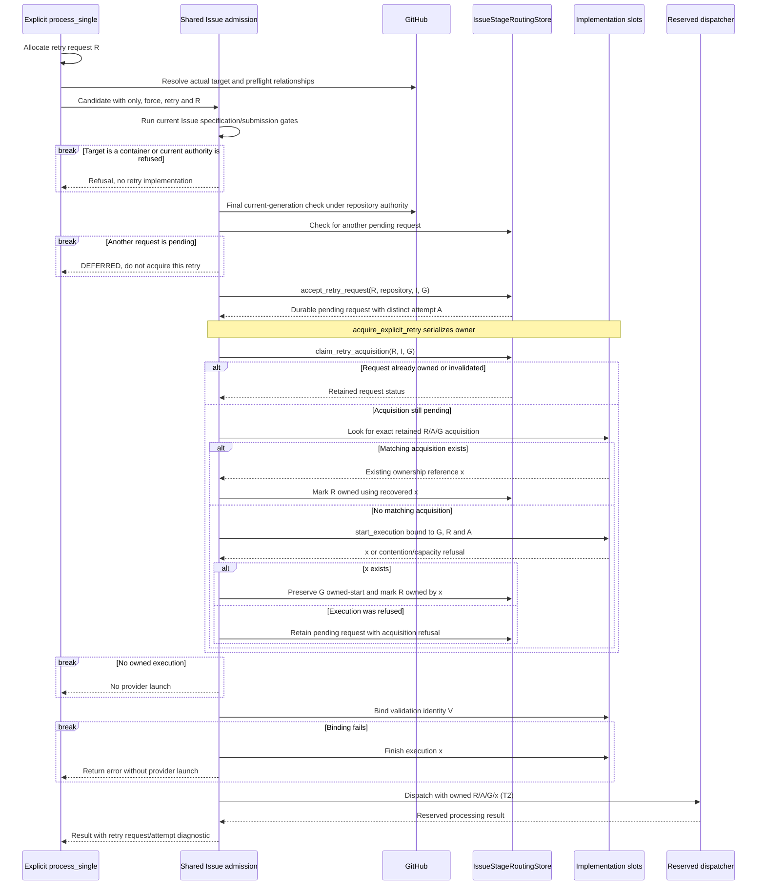
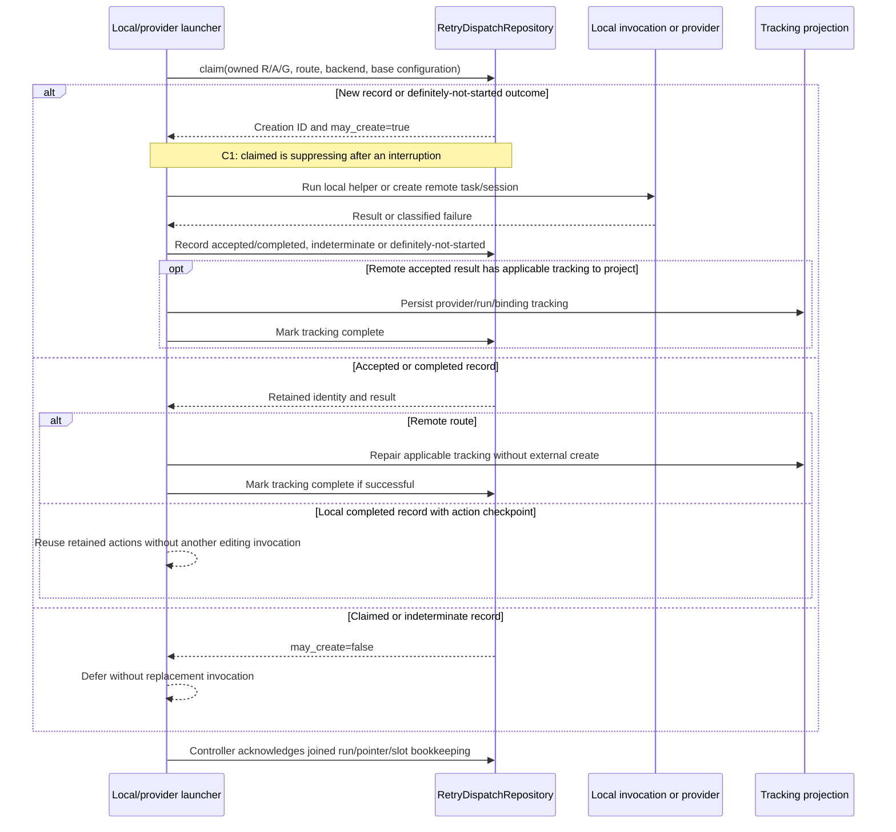
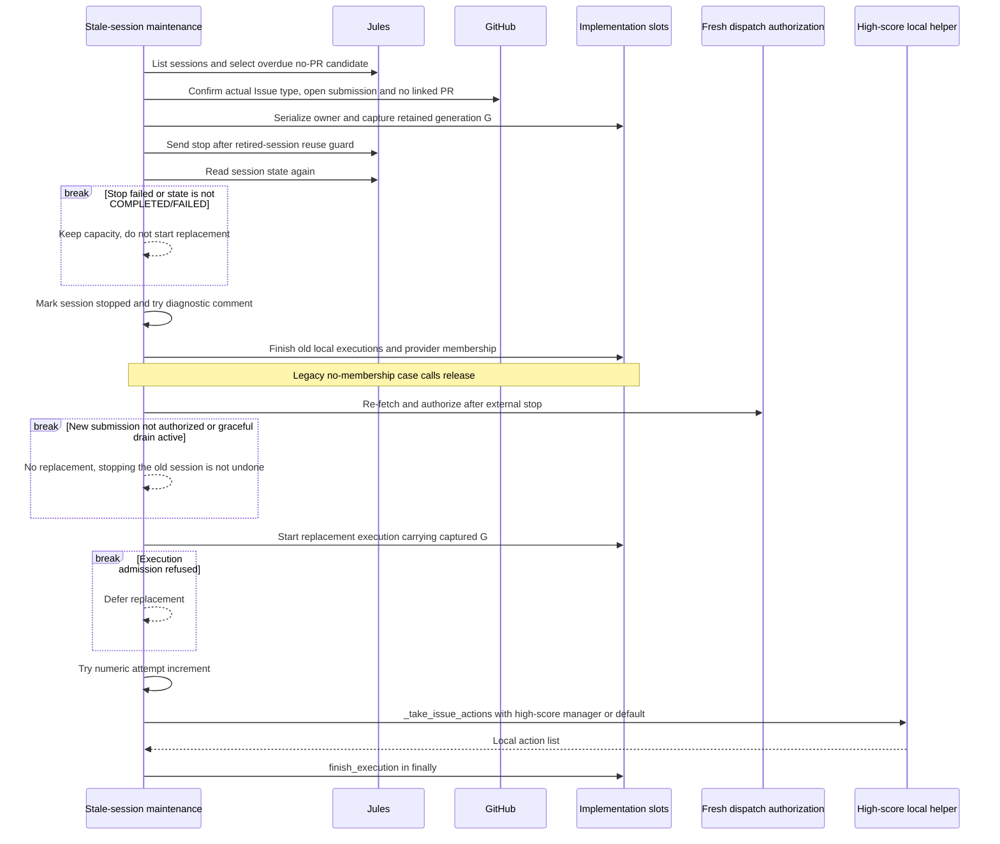
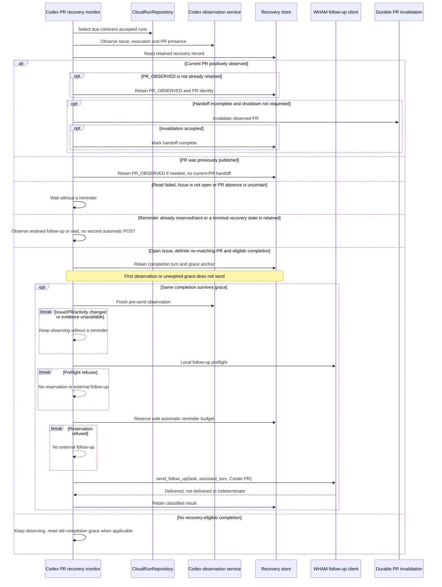

# Issue retry and recovery: as-is sequences

Snapshot: **`d704b54e59ea559cce17d5cfe1a0841ac3ef465d`**. [Issue lifecycle and identities](issue-implementation.md). A fresh operator retry, reentry for the same retained request, and ordinary wake/restart are different origins.

## T1. Explicit retry acquires new authority without deleting old starts

Entry: `process_single` with explicit Issue target, `force` and `retry`. Each invocation creates a request ID; internal reentry carries that same ID. A new CLI invocation is not automatically a replay of the previous request.

The slot's retry-acquisition reference recovers the gap between slot persistence and `mark_retry_owned`; the retry request is not treated as consumed merely because a caller started to handle it. Existing generation tombstones remain historical. `bypass_capacity=explicit_only` is passed, but the slot start can still refuse execution contention or hierarchy admission. No reset/delete of old provider records is part of T1. [Explicit entry][explicit] [Admission fork][admission] [Ownership acquisition][ownership]

The diagram's final bind refusal represents the following code ordering: the engine attempts `record_validation_identity`; on failure it finishes the execution and returns. The helper's replay branch for a retained owned request does not by itself prove a new provider task was accepted. For Codex, the reserved boundary consumes the exact request-scoped receipt and confirms its CloudRun, current binding, and logical-slot membership; it does not infer acceptance from a changed binding.

## T2. Reentry for the same owned request does not mean another create

Entry: a provider/local helper receiving an owned `ImplementationRetryRequest`. This describes the actual request-scoped replay mechanism, not an assertion that the daemon automatically replays every unfinished request through this helper.

The journal validates repository, Issue, request, attempt and generation. A suppressing record also binds route/backend/configuration; incompatible reentry raises conflict rather than silently switching providers. Only `definitely-not-started` permits reacquisition and can update the route while preserving the creation ID. Accepted receipts cannot be changed into “unsent.” [Journal][journal]

Provider-specific details remain different:

| Route | Actual retry behavior |
| --- | --- |
| Local | Claims before the local helper; a returned helper result is saved as completed with actions and the ownership reference. This is not proof that a PR exists or tests passed. Escaping errors can record indeterminate. |
| Jules / Claude Routine | Record accepted session identity before tracking. Their `is_latest_accepted` guard prevents older accepted requests from replacing a later accepted current pointer. Jules retry does not enter speculative fan-out. |
| Codex Cloud | Allocates one numeric attempt above observed attempts, projects it through attempt machinery, and additionally uses the CloudRun claim. An accepted retry receipt can reconstruct the run and binding; `ensure_binding` can still refuse contradictory tracking. |

Codex provider tracking is not the enclosing controller checkpoint. An
accepted receipt remains discoverable until the exact CloudRun and current
binding are confirmed and its task is durably present in the Issue's logical
slot (or retained retirement history). The daemon registers these records in
normal pending work at startup and retries only this local bookkeeping. This
recovery retains the original provenance and neither calls the provider nor
allocates a request or numeric attempt. Contention leaves the obligation due
for a later turn in the same daemon; a newer accepted claim makes an older
receipt historical.

These are not one universal exactly-once protocol. The replay diagram concerns the same `R`; it does not suppress every later operator-authorized `R2`. Claims surviving a pre-send crash can intentionally leave creation unresolved rather than authorize an unsafe resend. [Local retry wrapper][local] [Session and Codex retry paths][launchers]

## T3. Stale Jules replacement waits for confirmed termination

Entry: maintenance `handle_stale_jules_issue_sessions` for a mapped, non-stopped session older than the configured no-PR timeout. It checks both session output and GitHub-linked PR evidence before considering replacement.

The stop helper checks the returned terminal state, not just successful message delivery. It intentionally does not use the full ordinary outbound-work admission path for a stop; it does still guard retired-session reuse. After termination, reauthorization may read changed Issue text while the replacement carries the captured implementation generation. The numeric attempt increment is attempted separately, and an increment error is logged without unconditionally preventing the following local call. These details are preserved rather than normalized into a hypothetical single retry transaction. [Stop and stale selection][stale] [Replacement][replacement]

## T4. Accepted Codex task to initial PR handoff

Entry: `CodexPRRecoveryMonitor`, started separately by the daemon. It selects coherent accepted runs with task/backend/environment/base identities and the latest numeric attempt for that Issue. Default per-task polling is 60 seconds; completion grace is 120 seconds.

PR handoff happens only for PR_PRESENT, not merely PREVIOUSLY_PUBLISHED evidence. A retained handoff can be retried without a new implementation task. After a reminder reservation, subsequent observations do not spend another automatic POST budget; a later completion with causally new user/assistant turns but still no PR can lead to attention-needed state. A rejected/unknown send is not collapsed into an ordinary new implementation retry. The monitor cannot recover an initial submission that has no known task ID by guessing one. [Monitor and durable send reservation][recovery]

[explicit]: https://github.com/kitamura-tetsuo/auto-coder/blob/d704b54e59ea559cce17d5cfe1a0841ac3ef465d/src/auto_coder/automation_engine.py#L6800-L6935
[admission]: https://github.com/kitamura-tetsuo/auto-coder/blob/d704b54e59ea559cce17d5cfe1a0841ac3ef465d/src/auto_coder/automation_engine.py#L5980-L6155
[ownership]: https://github.com/kitamura-tetsuo/auto-coder/blob/d704b54e59ea559cce17d5cfe1a0841ac3ef465d/src/auto_coder/implementation_ownership.py
[reserved]: https://github.com/kitamura-tetsuo/auto-coder/blob/d704b54e59ea559cce17d5cfe1a0841ac3ef465d/src/auto_coder/automation_engine.py#L6290-L6415
[journal]: https://github.com/kitamura-tetsuo/auto-coder/blob/d704b54e59ea559cce17d5cfe1a0841ac3ef465d/src/auto_coder/retry_dispatch.py
[local]: https://github.com/kitamura-tetsuo/auto-coder/blob/d704b54e59ea559cce17d5cfe1a0841ac3ef465d/src/auto_coder/issue_processor.py#L105-L210
[launchers]: https://github.com/kitamura-tetsuo/auto-coder/blob/d704b54e59ea559cce17d5cfe1a0841ac3ef465d/src/auto_coder/issue_processor.py#L267-L850
[stale]: https://github.com/kitamura-tetsuo/auto-coder/blob/d704b54e59ea559cce17d5cfe1a0841ac3ef465d/src/auto_coder/issue_processor.py#L1117-L1350
[replacement]: https://github.com/kitamura-tetsuo/auto-coder/blob/d704b54e59ea559cce17d5cfe1a0841ac3ef465d/src/auto_coder/issue_processor.py#L1350-L1412
[recovery]: https://github.com/kitamura-tetsuo/auto-coder/blob/d704b54e59ea559cce17d5cfe1a0841ac3ef465d/src/auto_coder/codex_pr_recovery.py
