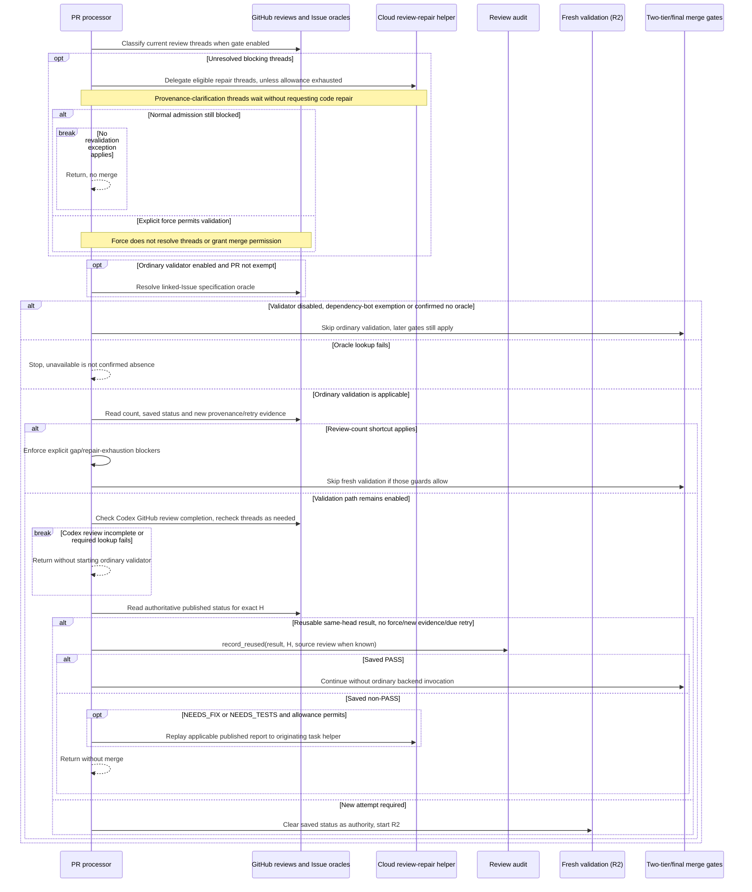
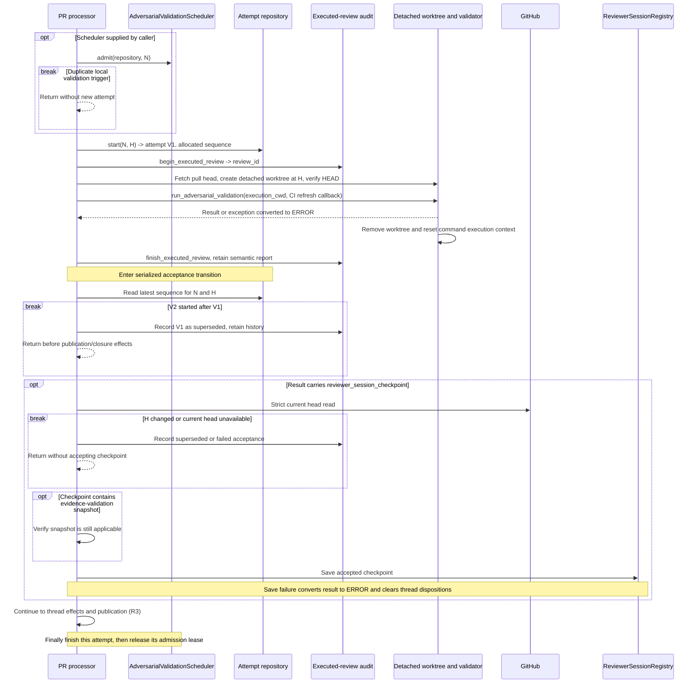
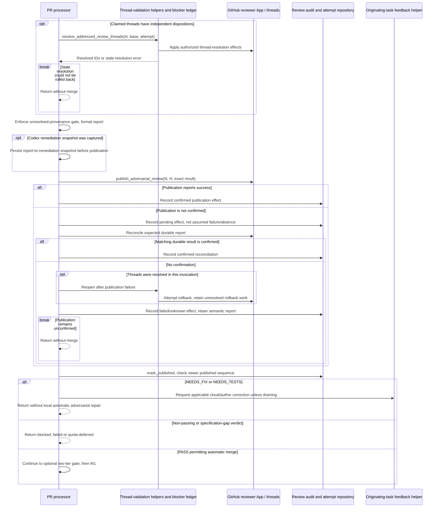

# Ordinary adversarial validation: as-is sequences

Snapshot: **`95ff379d2bd69e54a53f14c208eedaca5a58e3df`**. [Scope and notation](README.md).

## R1. Review-thread admission, eligibility and same-head reuse

Continuation from green CI in C1, with automatic merge enabled and no `disable-auto-merge` label. Ordinary validation, optional strong review, and final merge authorization are different boundaries.

Authoritative native reviews are selected using the dedicated reviewer App identity, exact-head marker and highest allocated attempt sequence, not response arrival order. The published-report helper also has a legacy-comment fallback. Reuse does not invent a missing historical audit `review_id`.

The review-count shortcut is important as-is behavior: under its conditions, the code sets `should_run_validation=False` and proceeds toward later gates. It explicitly stops unresolved specification gaps, `NEEDS_TESTS`, and exhausted repair allowance in that branch. This diagram therefore does **not** assert that every route reaching the two-tier `ordinary_pass` call executed a fresh ordinary PASS. New provenance evidence, older-head findings, explicit force and a due EXHAUSTED retry alter admission as shown in the source.

With the thread gate disabled, validation can still inspect claimed-addressed threads, but a lookup error in that optional read does not itself block the PR. Review results and final unresolved-thread gates remain separate; a scheduling predicate reporting “not adversarially blocked” is not merge permission.

Sources: [thread/oracle admission][admission], [count, Codex wait and reuse][reuse], [native-review ordering][native], [published-report fallback][report-fallback].

## R2. Execute at an exact head, then decide whether its effects are applicable

Precondition: R1 chose a fresh ordinary attempt. The scheduler lease is optional and process-local; the attempt repository provides persistent attempt identity/sequence. The diagram expands acceptance of a result with a reviewer-session checkpoint, and shows the condition explicitly.

A failed snapshot applicability check returns before saving. The strict acceptance-time head read shown above is **conditional on a checkpoint**; it is not silently generalized to every returned result. The final merge head check is another boundary (M1). An older-head result may remain historical evidence without authorizing a newer head.

Starting a forced new attempt clears the saved published status for this invocation: a new ERROR does not fall back to a saved PASS. The semantic audit is retained before downstream publication effects, so an audit record does not prove that a GitHub review was published. The attempt is finalized in `finally`, including error paths, before closing the optional scheduler lease.

Sources: [pinned worktree setup][worktree], [attempt execution and checkpoint acceptance][execution], [attempt finalization][finalization].

## R3. Thread dispositions, publication, reconciliation and rollback

Precondition: R2 survived applicable attempt/checkpoint guards. Thread dispositions may be applied independently of the PR-level verdict; publication success is a separate observable effect.

A newer published sequence returns as superseded before verdict-driven actions. A failed Codex remediation-snapshot write stops before publication. Generic thread-disposition exceptions are logged in the caller; the explicit stale-resolution rollback failure has the stronger stop shown above. On subsequent processing, pending stale rollbacks are retried before CI (C1).

| Ordinary result | Observed routing in this caller |
| --- | --- |
| `PASS` with automatic merge allowed | Continue to two-tier/final gates, not directly to merge. |
| `PASS_WITH_SPECIFICATION_GAPS` / pass that disallows auto-merge | Stop for unresolved specification policy gaps. |
| `NEEDS_FIX` | Ask originating cloud task/author for corrections; no local automatic adversarial code fix. |
| `NEEDS_TESTS` | Ask for focused regression protection, not production changes solely for the test gap. |
| `ERROR` | Failure diagnostic; no merge; can be reused as non-PASS on same-head admission. |
| `BLOCKED`, `INCONCLUSIVE` | Stop; no EXHAUSTED-style automatic same-head retry bypass here. |
| `EXHAUSTED` | Defer with published retry-not-before evidence; once due, R1 can admit same-head revalidation. This alone does not prove every caller schedules that wake. |

The table describes the ordinary verdict branch. It does not erase the preceding count-limit shortcut or any independent final gate.

Sources: [acceptance, resolution, publication and reconciliation][execution], [post-publication verdict routing][verdicts], [same-head EXHAUSTED handling][reuse].

[admission]: https://github.com/kitamura-tetsuo/auto-coder/blob/95ff379d2bd69e54a53f14c208eedaca5a58e3df/src/auto_coder/pr_processor.py#L3380-L3555
[reuse]: https://github.com/kitamura-tetsuo/auto-coder/blob/95ff379d2bd69e54a53f14c208eedaca5a58e3df/src/auto_coder/pr_processor.py#L3550-L3785
[native]: https://github.com/kitamura-tetsuo/auto-coder/blob/95ff379d2bd69e54a53f14c208eedaca5a58e3df/src/auto_coder/pr_processor.py#L2840-L2880
[report-fallback]: https://github.com/kitamura-tetsuo/auto-coder/blob/95ff379d2bd69e54a53f14c208eedaca5a58e3df/src/auto_coder/pr_processor.py#L3047-L3063
[worktree]: https://github.com/kitamura-tetsuo/auto-coder/blob/95ff379d2bd69e54a53f14c208eedaca5a58e3df/src/auto_coder/pr_processor.py#L3064-L3120
[execution]: https://github.com/kitamura-tetsuo/auto-coder/blob/95ff379d2bd69e54a53f14c208eedaca5a58e3df/src/auto_coder/pr_processor.py#L3770-L4021
[verdicts]: https://github.com/kitamura-tetsuo/auto-coder/blob/95ff379d2bd69e54a53f14c208eedaca5a58e3df/src/auto_coder/pr_processor.py#L4010-L4120
[finalization]: https://github.com/kitamura-tetsuo/auto-coder/blob/95ff379d2bd69e54a53f14c208eedaca5a58e3df/src/auto_coder/pr_processor.py#L4609-L4635
