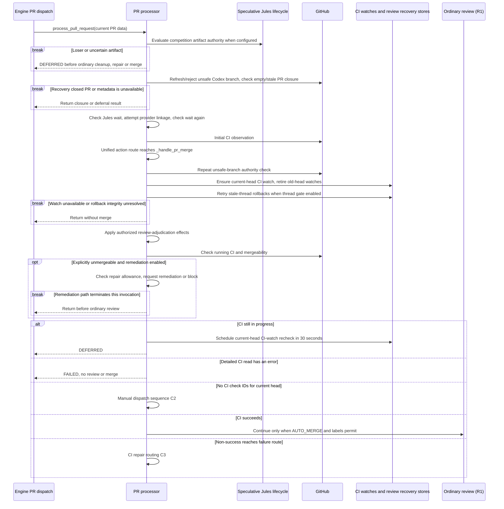
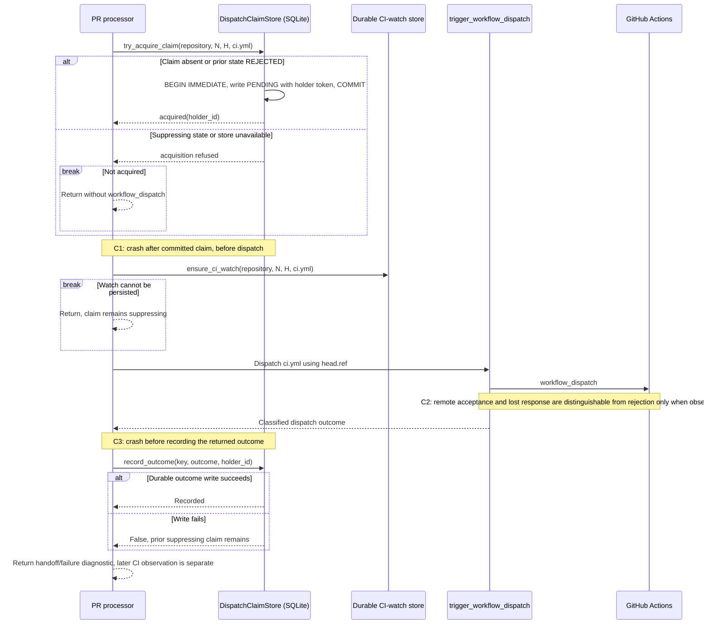
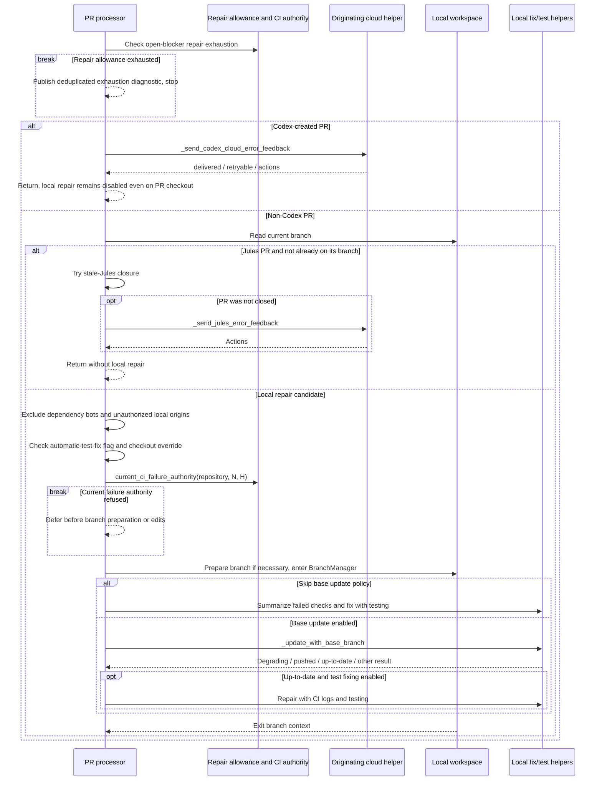

# PR intake, CI and repair: as-is sequences

Snapshot: **`95ff379d2bd69e54a53f14c208eedaca5a58e3df`**. [Scope and notation](README.md).

## C1. PR entry and the shared CI routing boundary

Entry: `process_pull_request`, after the engine's shared admission/ownership path. Some safety and cleanup checks also occur in the reserved engine boundary and again in `_handle_pr_merge`; those are repeated checks, not distinct lifecycle transitions.

The unmergeable branch returns after remediation only when that path is enabled; disabled remediation does not itself terminate the rest of the function. Repair exhaustion can stop it first. Review-adjudication application exceptions are caught and logged in this function, then processing continues with no adjudication actions; the diagram does not imply every auxiliary failure closes every gate.

Despite old call-site comments, `LabelManager` does not read, add or remove the historical processing label. Provider linkage is best effort. The post-merge loop that searches for other PRs with a Jules session ID contains no closing mutation in this snapshot; it is not depicted as automatic sibling-PR closure.

Sources: [PR entry][entry], [shared CI boundary][ci-boundary], [label scope implementation][labels], [post-merge handling][final-route].

## C2. No checks: claim, watch, dispatch, record

Precondition: `_handle_pr_merge` obtained a detailed status with no check IDs. The workflow identifier in this path is literally `ci.yml`; the code sends the PR's `head.ref` as the dispatch ref. The claim records head SHA `H`, but this diagram does not assert that a moving branch ref is an immutable remote execution target.

| Interruption/evidence at restart | What this code actually admits |
| --- | --- |
| No committed claim | A later call can acquire, provided the store is readable/writable. |
| C1: PENDING committed, dispatch never reached | The same key is still suppressed. The store has no automatic timeout that proves the request was never sent. |
| C2 or C3: send may have succeeded, outcome not durably recorded | PENDING/INDETERMINATE suppress redispatch of that key. Missing workflow evidence is not implemented here as permission to release it. |
| REJECTED durably recorded | A later acquisition changes it back to PENDING with a new holder token. |
| A different head SHA | A different dispatch key; an old-head claim does not occupy that key. |

The claim and CI watch are separate stores, not one atomic transaction. A persistence failure between them can therefore leave a suppressing claim without this dispatch's watch registration. The initial general current-head watch in C1 is a separate earlier operation. No exactly-once external-execution guarantee is inferred.

Sources: [caller ordering][dispatch-caller], [complete claim-store implementation][claim-store].

## C3. CI repair dispatch is provider- and checkout-dependent

Precondition: the non-success CI branch obtained detailed failed checks and has not been stopped by the repair-allowance guard. Green CI followed by a deferred/failed merge returns in its own route and does **not** enter this sequence.

A Jules PR already checked out locally may reach the local candidate branch; Codex classification takes precedence over that override. In the base-update path, a degrading-merge flag closes the PR, a pushed update returns to await CI, and an up-to-date result can proceed to tests. No specific failed checks means the respective repair call is skipped.

The diagram records a **call** to the Jules feedback helper, not a confirmed external receipt: this caller appends a handoff diagnostic after that helper returns. Likewise, entering a provider helper does not prove that quota, ownership, deduplication or transport checks inside it permitted a send. Those provider-specific internals are not flattened into an unconditional remote message here.

Sources: [green-CI false return and Codex precedence][final-route], [Jules/local eligibility and mutation boundary][repair].

[entry]: https://github.com/kitamura-tetsuo/auto-coder/blob/95ff379d2bd69e54a53f14c208eedaca5a58e3df/src/auto_coder/pr_processor.py#L1099-L1350
[ci-boundary]: https://github.com/kitamura-tetsuo/auto-coder/blob/95ff379d2bd69e54a53f14c208eedaca5a58e3df/src/auto_coder/pr_processor.py#L3137-L3270
[labels]: https://github.com/kitamura-tetsuo/auto-coder/blob/95ff379d2bd69e54a53f14c208eedaca5a58e3df/src/auto_coder/label_manager.py#L340-L393
[dispatch-caller]: https://github.com/kitamura-tetsuo/auto-coder/blob/95ff379d2bd69e54a53f14c208eedaca5a58e3df/src/auto_coder/pr_processor.py#L3271-L3380
[claim-store]: https://github.com/kitamura-tetsuo/auto-coder/blob/95ff379d2bd69e54a53f14c208eedaca5a58e3df/src/auto_coder/dispatch_claim_store.py#L1-L243
[final-route]: https://github.com/kitamura-tetsuo/auto-coder/blob/95ff379d2bd69e54a53f14c208eedaca5a58e3df/src/auto_coder/pr_processor.py#L4380-L4470
[repair]: https://github.com/kitamura-tetsuo/auto-coder/blob/95ff379d2bd69e54a53f14c208eedaca5a58e3df/src/auto_coder/pr_processor.py#L4470-L4635
