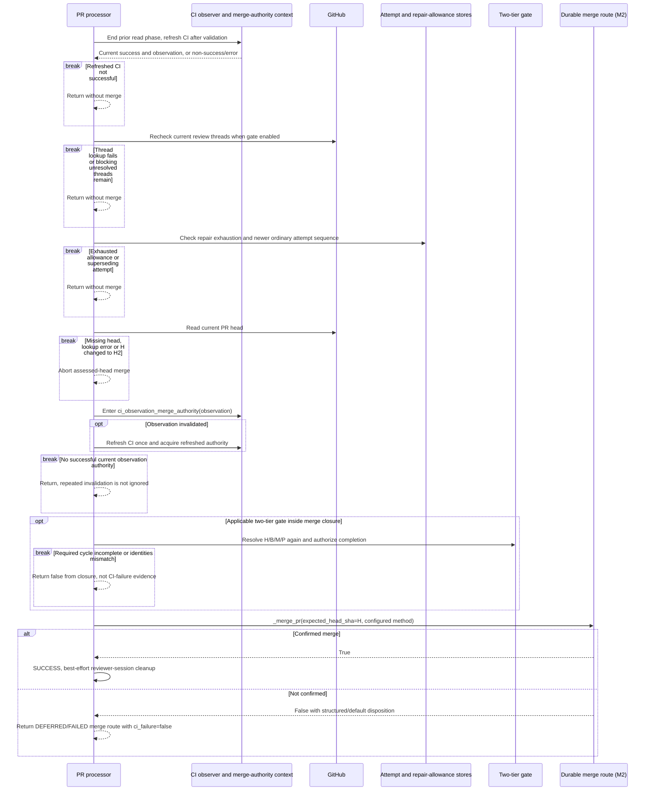
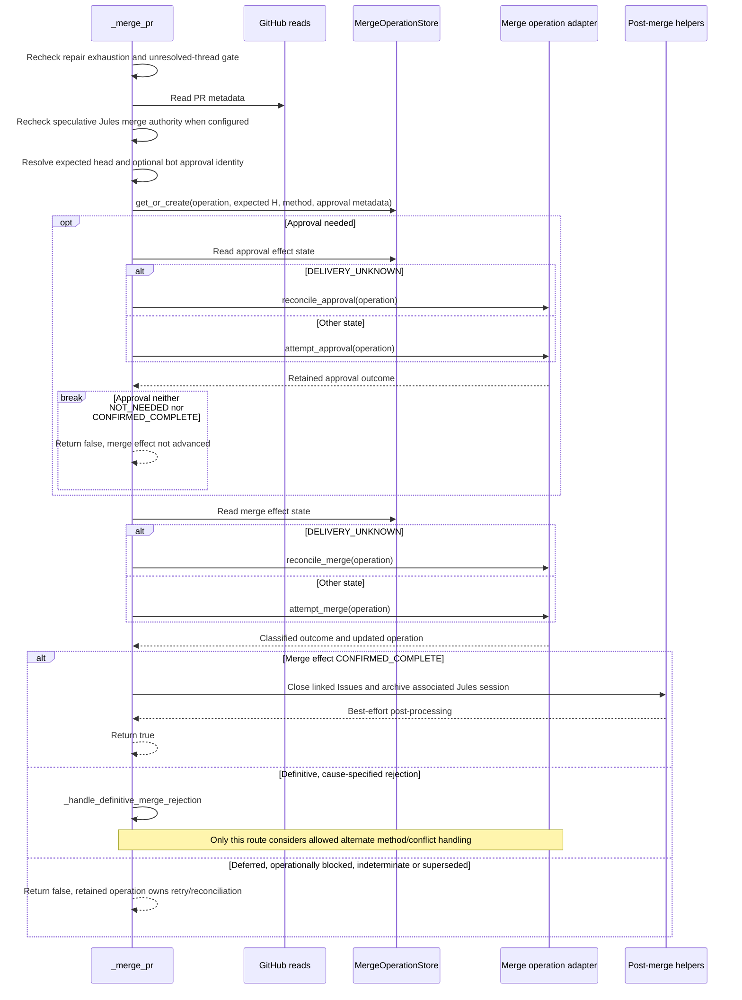
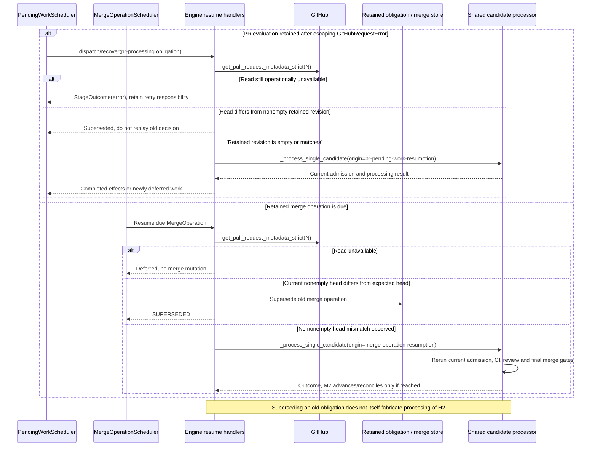

# PR merge and recovery: as-is sequences

Snapshot: **`95ff379d2bd69e54a53f14c208eedaca5a58e3df`**. [Scope and notation](README.md).

## M1. Final merge eligibility is reevaluated after reviewer work

Continuation from ordinary/optional strong processing that did not return early. This expands the production CI-observation path; the caller also retains a compatibility branch for adapters that supply no observation, which invokes the merge closure without that observation context.

`--force` affects validation admission but does not remove these final thread/head/CI checks. A PASS for `H` is not transferred to `H2`. The attempt-sequence guard applies when this invocation started an attempt; it is not a newly invented universal lock for every caller. The final PR read here calls `get_pull_request`; it is not relabeled as a different strict API in the diagram.

A false merge result after green CI returns from `_handle_pr_merge`. It does not fall through to `_send_codex_cloud_error_feedback`. `MergeRouteDisposition` defaults to DEFERRED where the lower route has not recorded a different disposition.

Sources: [final CI, thread, head, attempt and strong gates][final], [return instead of CI-repair fallthrough][route-return].

## M2. Approval and merge have separate retained effects

Entry: `_merge_pr`. The operation identity is **API origin + repository + PR number**. Expected head SHA, merge method and approval information are stored in the operation; they are not all fields of that key. The specialized adapter owns actual mutation admission and transport classification, while this diagram traces the processor's calls to it.

The caller avoids treating ambiguous delivery, throttling and operational blocks as reasons for diagnostic GETs, alternate merge methods, conflict repair or an LLM fallback. That statement concerns the response-handling branch; ordinary gate reads already occurred before entering it. A confirmed approval is not evidence of a confirmed merge, and post-merge helper failure does not turn the confirmed merge back into an unconfirmed mutation.

Bot classification attempts to resolve a reviewer identity; the caller sets `needs_approval` from whether that identity was obtained. The diagram therefore does not claim every bot PR necessarily gets an approval in this code path. Exact adapter-internal persistence/transport steps are intentionally not invented here.

Sources: [durable merge caller and post-processing][merge-caller].

## M3. Restart and due retries reenter the shared PR path

These are two distinct recovery origins, both registered during E1. The diagram describes their head-refresh behavior, not a promise that every interrupted local operation has one global resumable journal.

Normal invalidation/webhook handling is responsible for evaluating the replacement head after these handlers reject a stale obligation. A merge-operation scheduler owns timing from its own store, not a duplicated `pr-processing` obligation. Two-tier review deadlines instead return through the invalidation worker's targeted deferral (E2/S1).

## Interruption boundaries that remain distinct

| Boundary | Retained observation / recovery in the inspected code |
| --- | --- |
| Ordinary model completed, publication not confirmed | Audit report can exist without a confirmed GitHub review; R3 reconciles the exact expected publication and reopens affected threads if confirmation fails. |
| Strong result accepted, publication pending | The accepted payload and pending effect are retained; S1 consumes that effect rather than equating semantic acceptance with delivery. |
| Merge/approval delivery classified unknown | M2 selects reconciliation for that specific effect instead of blindly treating the request as unsent. |
| Merge operation due after restart | M3 refreshes the head and reenters current gates; a retained operation is not unconditional permission to merge. |
| Local launcher returns while provider task still exists | E4 ends the local execution but records/retains provider membership in the logical owner. |
| Graceful shutdown during admitted local work | Startup/shutdown code stops new admission and waits for protected local invocations/cleanup; it does not claim that a remote provider task has been cancelled. |

Sources: [PR and merge resume handlers][resume], [startup and graceful drain][startup], [ordinary publication handling][ordinary-publication], [strong publication handling][strong-publication], [execution versus ownership][ownership].

[final]: https://github.com/kitamura-tetsuo/auto-coder/blob/95ff379d2bd69e54a53f14c208eedaca5a58e3df/src/auto_coder/pr_processor.py#L4210-L4380
[route-return]: https://github.com/kitamura-tetsuo/auto-coder/blob/95ff379d2bd69e54a53f14c208eedaca5a58e3df/src/auto_coder/pr_processor.py#L4380-L4447
[merge-caller]: https://github.com/kitamura-tetsuo/auto-coder/blob/95ff379d2bd69e54a53f14c208eedaca5a58e3df/src/auto_coder/pr_processor.py#L7444-L7630
[resume]: https://github.com/kitamura-tetsuo/auto-coder/blob/95ff379d2bd69e54a53f14c208eedaca5a58e3df/src/auto_coder/automation_engine.py#L316-L504
[startup]: https://github.com/kitamura-tetsuo/auto-coder/blob/95ff379d2bd69e54a53f14c208eedaca5a58e3df/src/auto_coder/automation_engine.py#L2467-L2668
[ordinary-publication]: https://github.com/kitamura-tetsuo/auto-coder/blob/95ff379d2bd69e54a53f14c208eedaca5a58e3df/src/auto_coder/pr_processor.py#L3950-L4021
[strong-publication]: https://github.com/kitamura-tetsuo/auto-coder/blob/95ff379d2bd69e54a53f14c208eedaca5a58e3df/src/auto_coder/pr_processor.py#L436-L486
[ownership]: https://github.com/kitamura-tetsuo/auto-coder/blob/95ff379d2bd69e54a53f14c208eedaca5a58e3df/src/auto_coder/automation_engine.py#L6040-L6102
