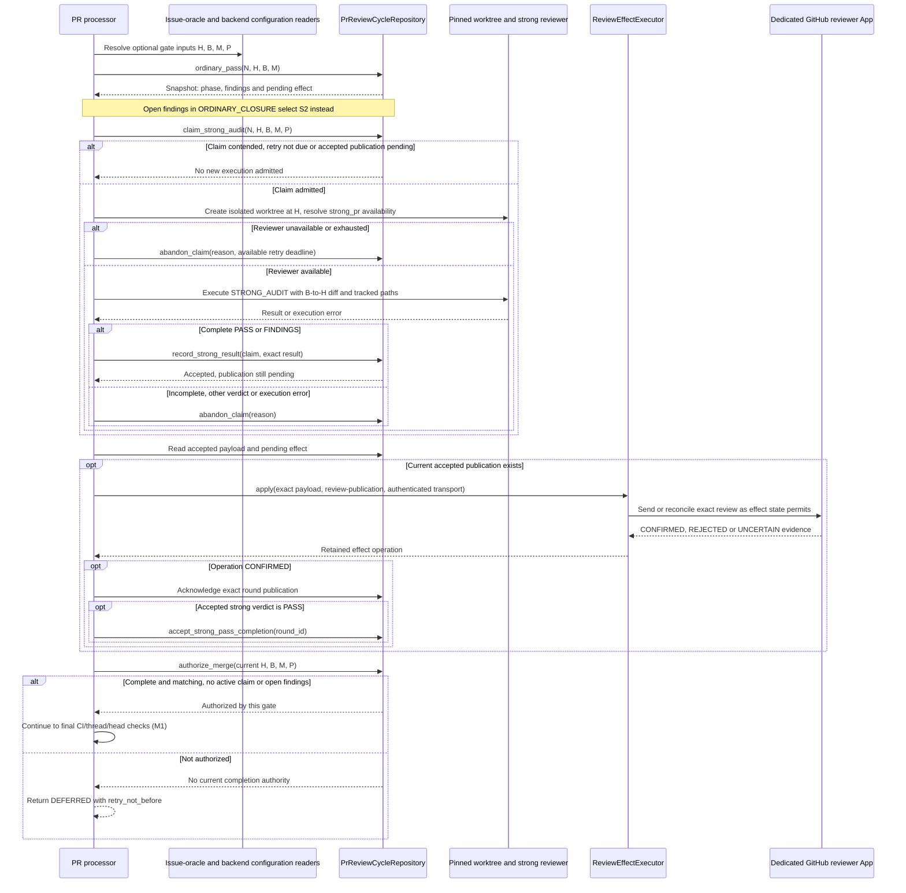
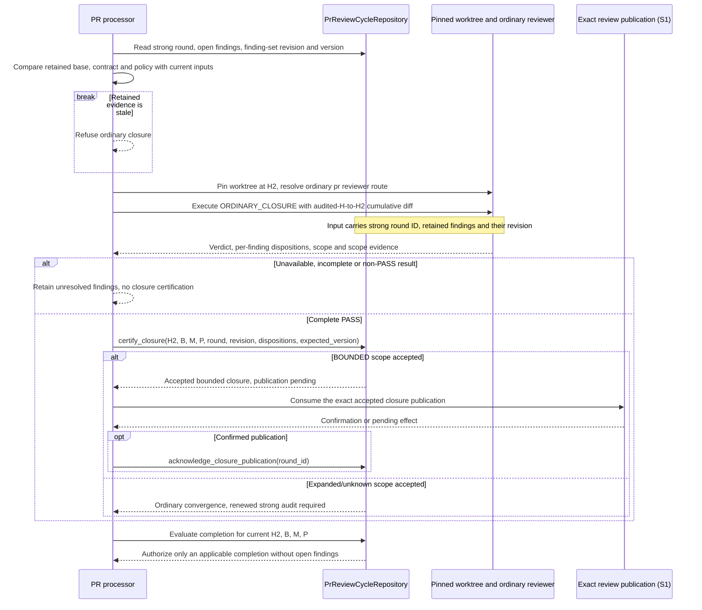

# Two-tier PR review: as-is sequences

Snapshot: **`95ff379d2bd69e54a53f14c208eedaca5a58e3df`**. [Scope and notation](README.md).

## S1. Ordinary convergence, strong execution and publication are separate

Entry: the ordinary path reaches the two-tier block in `_handle_pr_merge`. `_two_tier_gate_inputs` returns no optional gate when no strong route is configured, no linked Issue oracle exists, or no numbered declarations are collected. An oracle lookup error or missing head/base for an applicable gate stops processing instead of becoming a bypass.

`M` is built from linked Issue identities and the numbered `REQ-NNN:` declarations collected by `_numbered_requirements`. That helper scans matching lines in each body; it is not the full Issue Requirements-section parser. `P` includes the strong route/model options/protocol. `H` and `B` come from the supplied PR data and are checked again at the final merge boundary.

The availability check precedes reviewer execution; incomplete or non-PASS/non-FINDINGS results abandon the claim without accepting a review. A claim owned by another controller is refused; a same-controller claim for the same identity can be returned unchanged. A changed identity can supersede an old active claim in the state transition logic.

The caller invokes the strong-attempt helper on the non-closure path; “pending” in the helper name is not a claim that every previously complete cycle avoids another invocation. The state store decides claim applicability. In particular, accepted-but-unpublished strong evidence blocks a new claim and is consumed by the publication path instead.

The publication callback `is_current` checks **local durable state**: open epoch, closed flag, accepted round, finding-set revision and pending-effect identity. It is not itself a fresh remote HEAD read. The final gate checks completion against current `H/B/M/P`. The transport only treats an exact authenticated review match as confirmation; an unavailable listing stays uncertain, while a completed authenticated listing establishing absence is classified as rejected evidence.

For a daemon invalidation candidate, a returned review deadline is persisted by the worker as a targeted `pr-review-cycle` deferral (E2), so it can reenter ordinary PR processing without a new webhook. The caller chooses `pending_snapshot.retry_not_before` or `now + 60 seconds`; that snapshot was read **before** this helper execution. This document does not silently replace it with a fresh post-execution snapshot or assert the same wake behavior for a one-shot CLI invocation.

Sources: [gate input construction and strong helper][helpers], [publication consumer and transport][publication], [caller and timed return][caller], [claim and phase transitions][state], [final authorization predicate][gate], [worker's durable deadline consumer][worker].

## S2. Strong findings are retained while ordinary closure examines repairs

Precondition: the cycle has an accepted strong round with open findings, phase `ORDINARY_CLOSURE`, and a subsequent PR evaluation reaches the two-tier block. The caller selects this helper instead of the strong helper. The sequence does not invent a strong-finding repair dispatch: how the repair head `H2` was produced is an external precondition here.

The certification request carries the captured version and finding-set inputs; simply receiving an ordinary PASS is not shown as deleting strong findings. The actual caller attempts pending-publication consumption after either helper returns. Thus a previously accepted publication can be reconciled even when this invocation did not perform a new successful review. `STRONG_PENDING` can mean “needs execution”, “retry deferred”, or “accepted result awaiting publication”; phase text alone is not a delivery receipt.

Sources: [ordinary closure helper][closure], [caller selection and publication consumption][caller], [phase derivation][state], [authorization predicate][gate].

[helpers]: https://github.com/kitamura-tetsuo/auto-coder/blob/95ff379d2bd69e54a53f14c208eedaca5a58e3df/src/auto_coder/pr_processor.py#L191-L327
[closure]: https://github.com/kitamura-tetsuo/auto-coder/blob/95ff379d2bd69e54a53f14c208eedaca5a58e3df/src/auto_coder/pr_processor.py#L320-L389
[publication]: https://github.com/kitamura-tetsuo/auto-coder/blob/95ff379d2bd69e54a53f14c208eedaca5a58e3df/src/auto_coder/pr_processor.py#L389-L486
[caller]: https://github.com/kitamura-tetsuo/auto-coder/blob/95ff379d2bd69e54a53f14c208eedaca5a58e3df/src/auto_coder/pr_processor.py#L4110-L4220
[state]: https://github.com/kitamura-tetsuo/auto-coder/blob/95ff379d2bd69e54a53f14c208eedaca5a58e3df/src/auto_coder/pr_review_cycle.py#L517-L745
[gate]: https://github.com/kitamura-tetsuo/auto-coder/blob/95ff379d2bd69e54a53f14c208eedaca5a58e3df/src/auto_coder/two_tier_pr_gate.py#L33-L86
[worker]: https://github.com/kitamura-tetsuo/auto-coder/blob/95ff379d2bd69e54a53f14c208eedaca5a58e3df/src/auto_coder/automation_engine.py#L3740-L3780
