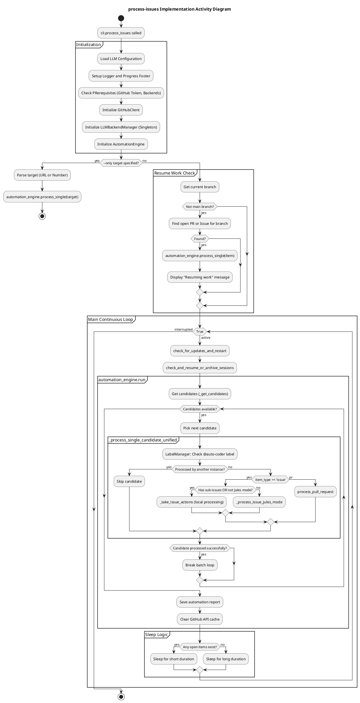

# process-issues Implementation Activity Diagram

This diagram visualizes the implementation logic of the `process-issues` command in Auto-Coder.

```plantuml
@startuml
title process-issues Implementation Activity Diagram

start

:cli.process_issues called;

partition "Initialization" {
    :Load LLM Configuration;
    :Setup Logger and Progress Footer;
    :Check PRerequisites (GitHub Token, Backends);
    :Initialize GitHubClient;
    :Initialize LLMBackendManager (Singleton);
    :Initialize AutomationEngine;
}

if (--only target specified?) then (yes)
    :Parse target (URL or Number);
    :automation_engine.process_single(target);
    stop
else (no)
    partition "Resume Work Check" {
        :Get current branch;
        if (Not main branch?) then (yes)
            :Find open PR or Issue for branch;
            if (Found?) then (yes)
                :automation_engine.process_single(item);
                :Display "Resuming work" message;
            endif
        endif
    }

    partition "Main Continuous Loop" {
        while (True) is (active)
            :check_for_updates_and_restart;
            :check_and_resume_or_archive_sessions;

            partition "automation_engine.run" {
                :Get candidates (_get_candidates);
                while (Candidates available?) is (yes)
                    :Pick next candidate;
                    partition "_process_single_candidate_unified" {
                        :LabelManager: Check @auto-coder label;
                        if (Processed by another instance?) then (yes)
                            :Skip candidate;
                        else (no)
                            if (item_type == 'issue') then (yes)
                                if (Has sub-issues OR not Jules mode?) then (yes)
                                    :_take_issue_actions (local processing);
                                else (no)
                                    :_process_issue_jules_mode;
                                endif
                            else (pr)
                                :process_pull_request;
                            endif
                        endif
                    }
                    if (Candidate processed successfully?) then (yes)
                        :Break batch loop;
                    endif
                endwhile
                :Save automation report;
                :Clear GitHub API cache;
            }

            partition "Sleep Logic" {
                if (Any open items exist?) then (yes)
                    :Sleep for short duration;
                else (no)
                    :Sleep for long duration;
                endif
            }
        endwhile (interrupted)
    }
endif

stop
@enduml
```
